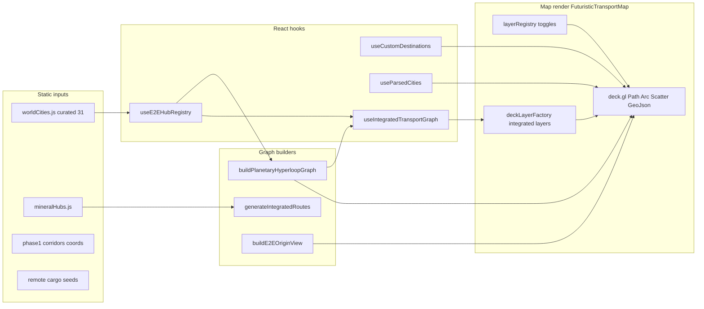

# Current Map Data — System Mindmap

**Status:** Read-only inventory (May 2026). App builds and runs at `localhost:5175`; no map/UI changes from this doc.

**Checkpoint:** `npm.cmd run build` — pass. Git — no commits on `master` yet (working tree preserved on disk).

---

## Mermaid mindmap

```mermaid
mindmap
  root((Planetary Mobility OS Current Map Data))
    Modes
      E2E Starship
        Hubs
          Curated ROI hubs 31 cities
          User active hub selection localStorage
        Routes
          Starship arcs from origin hub
          E2E feeder routes slice
        Arc Lines
          deck ArcLayer starship-routes
        Data Files
          worldCities.js CURATED_NETWORK_CITIES
          useE2EHubRegistry.js
          buildE2EOriginView.js
          hyperloopRouteClasses.js STARSHIP threshold
      E2M
        Hubs
          Mineral hubs DEFAULT_MINERAL_HUBS
          Orbital launch ports E2M_ORBITAL_SEEDS
        Routes
          generateE2MRoutes.js integrated
          E2M orbital paths e2mOrbitalNodes.js
        Remote Nodes
          remoteCargoResourceNodes.js
          remoteStrategicNodes.js
        Resource Nodes
          mineralHubs.js buildMineralHubConnections.js
        Data Files
          e2mOrbitalNodes.js
          mineralHubs.js
          generateE2MRoutes.js
      Hyperloop
        Global Spine
          planetaryContinentalSpines.js
          applyContinentalSpines.js
        Continental Spine
          hyperloopContinentalCorridors.js
        Regional Loops
          phase1GlobalHyperloopGraph.js corridors
        Feeder Cities
          regionalFeederCities.js
          applyFeederTrunkAttachment.js
        Tube Corridors
          planetaryInfrastructureTrunks.js
          hyperloopCrosslinks.js
        Data Files
          buildPlanetaryHyperloopGraph.js
          phase1GlobalHyperloopGraph.js
          hyperloopPhase1Cities.js
          hyperloopPhase1Coordinates.js
      Loop
        Loop Hubs
          Cities with loop_enabled
        Loop Routes
          generateLoopRegionalRoutes.js
        Regional Connectors
          Nearest E2E or hyperloop anchor
        Data Files
          generateLoopRegionalRoutes.js
          integratedGraphTypes EDGE_MODES.LOOP
      Robotaxi / Auto
        Hub Zones
          buildRobotaxiServiceZones robotaxiLayer.js
        Local Feeders
          Trunk stations plus custom destinations
        Service Areas
          GeoJSON polygons deck layers
        Data Files
          robotaxiLayer.js
          layers robotaxiVisibility.js
          MODE_REGISTRY auto overlayOnly
      Planning Grid
        Planning Nodes
          buildWorldCitiesPlanningGrid classifyWorldCityInfrastructure.js
        Planning Edges
          Not graph edges overlay only
        Strategic Nodes
          remoteStrategicNodes globalCoverageRegions
        Construction Metrics
          constructionMetrics.js applyEdgeConstruction.js
        Data Files
          planningLayers.js
          infrastructureRoles.js
          globalConnectivityCorridors.js
      Custom Destinations
        User Added Cities
          userCustomDestinations.js localStorage hook
        Parsed Cities
          features parsing parseCities.js
        Overlay Only Nodes
          No canonical graph membership
        Data Files
          customDestinationConstants.js
          parsedCitiesLayer.js
          customConnectionPreview.js
    Node Types
      Global Hub
        CURATED_NETWORK_CITIES tier 0 E2E
      E2E Hub
        isE2EHub roiHubs active registry
      Hyperloop Station
        Switch city tier nodes phase1 graph
      Loop Stop
        loop_enabled cities integrated
      Feeder City
        regionalFeederCities E2E radial
      E2M Remote Hub
        mineral_hub_id nodes
      Robotaxi Zone
        Generated polygons not CSV cities
      Planning Node
        infrastructure role scatter grid
      Cargo Node
        REMOTE_NODE_TYPES remote cargo seeds
      Strategic Node
        GLOBAL_COVERAGE_SEEDS rare earth
      Custom Destination
        User or parsed overlay
    Route Types
      Global Arc
        E2E starship ArcLayer
        integrated e2e ArcLayer
      Ground Tube
        Hyperloop PathLayer trunk regional
      Regional Loop
        Loop PathLayer integrated-loop-routes
      Feeder Route
        E2E feeder hyperloop feeder attachment
      Cargo Corridor
        remoteCargoRoutes extendedRuralNetwork
      Planning Edge
        global-connectivity-corridors manual
      Local Connector
        Robotaxi pickup dropoff custom preview
    Data Sources
      Current JS Data Files
        src data graph modes layers
      Current Utils
        constructionMetrics routeTooltip hyperloopRouteStyles
      Current Graph Builders
        buildPlanetaryHyperloopGraph generateIntegratedRoutes
      Current Layer Registry
        layerRegistry.js overlayRegistry.js
      Uploaded City Data
        world-cities.csv Route Optimizer only
      Generated Route Data
        Runtime useMemo planetary and integrated graphs
    Problems To Fix Later
      Duplicate Cities
        CSV vs curated vs manual coords
      Missing Coordinates
        world-cities.csv no lat lon in file
      Choppy Lines
        Long arcs zoom tier filtering
      Unclear Route Ownership
        Legacy skeleton vs integrated hyperloop
      Too Many Visual Layers
        MAP_LAYER_REGISTRY 40 plus toggles
      Routes Not Connected Across Modes
        Separate generators not one canonical graph
      Hyperloop Lines Not Clean Enough
        Mesh prune repair passes still dense
      Robotaxi Showing Too Globally
        Hub mobility mode gating needed review
      Need Canonical Graph Later
        generateIntegratedRoutes partial merge only
```

---

## Runtime data flow (how pieces connect)

---

## Transport modes (UI tabs)

| UI mode | Constant | Primary data path |
|---------|----------|-------------------|
| E2E Starship | `TRANSPORT_MODES.E2E_STARSHIP` | `buildE2EOriginView` + origin selection |
| E2M Orbital | `TRANSPORT_MODES.E2M_ORBITAL` | `e2mOrbitalNodes.js` + mineral overlay |
| Hyperloop Core Web | `TRANSPORT_MODES.HYPERLOOP_CORE` | `buildPlanetaryHyperloopGraph` full web |
| **Civilization Grid** (default) | `TRANSPORT_MODES.CIVILIZATION_GRID` | Integrated graph + legacy skeleton fallback |
| Robotaxi | `TRANSPORT_MODES.ROBOTAXI` | `robotaxiLayer.js` zones |

Registry: `src/data/transportOperatingSystem.js`, `src/modes/modeRegistry.js` (integrated mode IDs: `e2e`, `e2m`, `hyperloop`, `loop`, `auto`).

---

## See also

- [current-map-node-inventory.md](./current-map-node-inventory.md)
- [current-map-route-inventory.md](./current-map-route-inventory.md)
- [current-map-data-issues.md](./current-map-data-issues.md)
